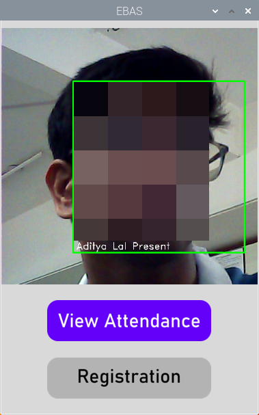

# Biometric Attendance System

B.A.S. is a facial-recognition based attendance management system developed using Raspberry Pi, Python, and MySQL, featuring a user-friendly Tkinter interface.

## Features

- **UI with Tkinter**: Designed a dynamic Tkinter UI with custom buttons, featuring a live feed display using OpenCV.  
- **Attendance Management**: Implemented MySQL integration for new registrations and viewing attendance metrics.
<p>Main Window (blurred for privacy):</p>


## Prerequisites
- Install MySQL on your system

## MySQL Setup
1. Open the MySQL terminal.
2. Run the following script:
   (Make sure to replace `USER` and `pwd` with your desired username and password, and update `src/config.py` accordingly)

   ```sql
   create user USER@localhost identified by 'pwd';
   grant all on *.* to USER@localhost;

   -- Create database
   CREATE DATABASE attendance;

   -- Create table for student records
   CREATE TABLE attendance.student (
       roll_no INT NOT NULL PRIMARY KEY,
       fname VARCHAR(255),
       lname VARCHAR(255),
       email_id VARCHAR(255),
       present_percentage FLOAT
   );

   -- Create table for attendance records
   CREATE TABLE attendance.record_student (
       roll_no INT,
       date DATE,
       presence ENUM('y', 'n') DEFAULT 'n',
       FOREIGN KEY (roll_no) REFERENCES student(roll_no)
   );
   ```

## Installation

1. **Clone the repository:**
    ```bash
    git clone https://github.com/aditya17lal/Embedded_Biometric_Attendance_System.git
    cd Embedded_Biometric_Attendance_System
    ```

2. **Activate the virtual environment:**
    - **Windows:**
        ```bash
        venv\Scripts\activate
        ```
    - **Unix-based systems (venv to be uploaded soon):**
        ```bash
        source venv/bin/activate
        ```

## Usage
1. Ensure the MySQL server is running, the database is set up, and `src/config.py` is updated.
2. Run the main application:
    ```bash
    python main.py
    ```
3. Use the buttons on-screen to register students and manage attendance.
