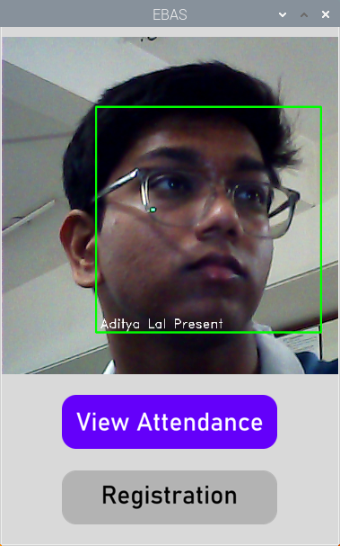

# Embedded Biometric Attendance System

Welcome to the E.B.A.S. project! This system leverages a Raspberry Pi, Python, and MySQL to create a comprehensive attendance tracking solution using facial recognition.

## Features
- **Dynamic UI**: Designed a dynamic user interface with customized buttons and real-time face recognition.
- **Attendance Management**: Developed functionalities for registration and viewing attendance metrics.
- **Robust CRUD Operations**: Implemented robust Create, Read, Update, Delete operations for managing user records in the MySQL database.


## Prerequisites
- Install MySQL on your system

## MySQL Setup
1. Open the MySQL terminal.
2. Run the following script:
   (Make sure to replace `USER` and `pwd` with your desired username and password, and update `src/config.py` accordingly)

   ```sql
   create user USER@localhost identified by 'pwd';
   grant all on *.* to USER@localhost;

   -- Create database
   CREATE DATABASE attendance;

   -- Create table for student records
   CREATE TABLE attendance.student (
       roll_no INT NOT NULL PRIMARY KEY,
       fname VARCHAR(255),
       lname VARCHAR(255),
       email_id VARCHAR(255),
       present_percentage FLOAT
   );

   -- Create table for attendance records
   CREATE TABLE attendance.record_student (
       roll_no INT,
       date DATE,
       presence ENUM('y', 'n') DEFAULT 'n',
       FOREIGN KEY (roll_no) REFERENCES student(roll_no)
   );
   ```

## Installation

1. **Clone the repository:**
    ```bash
    git clone https://github.com/aditya17lal/Embedded_Biometric_Attendance_System.git
    cd Embedded_Biometric_Attendance_System
    ```

2. **Activate the virtual environment:**
    - **Windows:**
        ```bash
        venv\Scripts\activate
        ```
    - **Unix-based systems (venv to be uploaded soon):**
        ```bash
        source venv/bin/activate
        ```

## Usage
1. Ensure the MySQL server is running, the database is set up, and `src/config.py` is updated.
2. Run the main application:
    ```bash
    python main.py
    ```
3. Follow the on-screen instructions to register students and manage attendance.

## Contributing
This is a relatively barebones approach for a project like this, and I'm open to contributions and refinements from anyone interested, let's make this better together!
